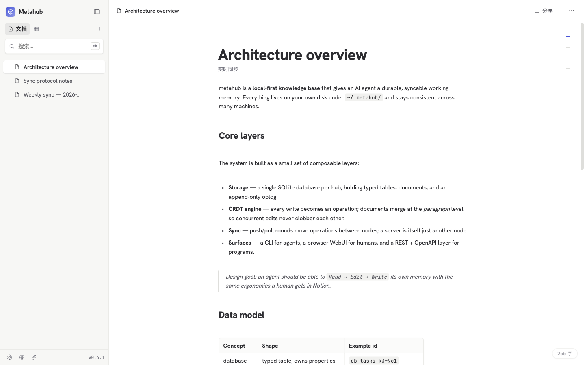
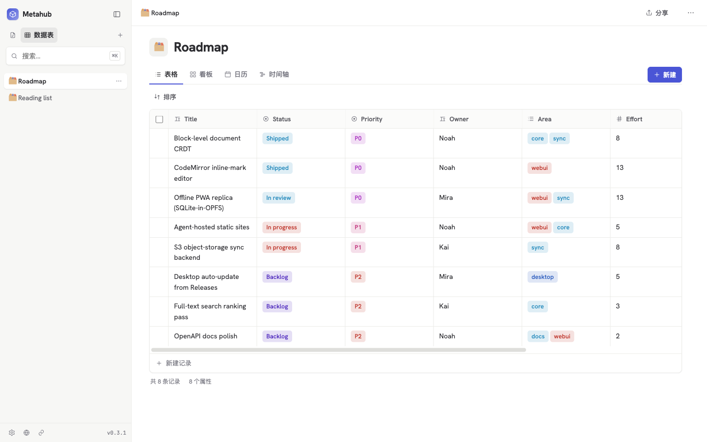

# metahub

**Give your AI a local knowledge base.**

English · [简体中文](./README.zh-CN.md)

metahub is a local-first knowledge base CLI built on Bun + SQLite. It gives an AI agent a durable, syncable working memory: Notion-style **typed tables** for structured data, **Markdown documents** for long-form knowledge, and a `Read / Edit / Write`-style editing interface. Everything lives on your own machine under `~/.metahub/` — offline on one machine, and consistent across many.

<p align="center">
  
</p>

> Requires [Bun](https://bun.sh). Use `bunx`, a global `mh` install, or a standalone binary.

## Why metahub

- **Built for AI read/write** — `doc read` returns the body plus a version token; `doc edit --old/--new` does an anchored find-and-replace that sends only the delta. Refer to anything by id prefix or name — no pasting full ids.
- **Structured and unstructured in one place** — typed tables (rows, columns, 8 property types) for tasks, ledgers, contacts; Markdown documents for notes and specs.
- **Local-first and syncable** — your data sits on your own disk and works offline; multiple machines merge cleanly, and edits to different paragraphs don't clobber each other.
- **GUI and API included** — `mh --server` starts a browser WebUI (browse, inline-edit, full-text search), a `/api/*` REST interface, and auto-generated OpenAPI docs.

<p align="center">
  
</p>

> Want to see the UI? Install the [desktop app](#install) or run `mh --server` and open `http://localhost:7777/`.

## Quick start

```bash
bunx @tensorix/metahub init                          # create ~/.metahub
mh db create "Tasks"                                 # create a table → returns an id like db_tasks-k3f9c1
mh use tasks                                         # set the "current db"; record/prop commands target it
mh prop add Title  --type text
mh prop add Status --type select --options "todo,doing,done"
mh record create --data '{"Title":"Write spec","Status":"todo"}'
mh doc create --title "Architecture" --body @arch.md  # @file / @- / inline string
mh search "architecture"                             # full-text over documents + records
```

Refer to entities by **full id, unique prefix, or name** — ambiguity is reported with candidates.

**Incremental editing for AI** (mirrors `Read / Edit / Write`):

```bash
mh doc read <ref>                                    # read body + version (read before editing)
mh doc edit <ref> --old "old text" --new "new text"  # anchored replace; delta only
mh doc append <ref> --body "a new paragraph"         # prepend also exists
```

Output adapts to the audience: a terminal (human) gets tables / Markdown, a pipe or subprocess (AI) gets **JSON**. Force it with `--json` / `--pretty`.

## Install

| Form | Install | For |
| --- | --- | --- |
| **Desktop app** (GUI) | `brew install --cask tensorix/tap/metahub-app` | A graphical, Notion-like experience |
| **CLI** | `brew install tensorix/tap/metahub-cli`, or `npm i -g @tensorix/metahub`, or `bunx @tensorix/metahub <cmd>` | AI agents and the command line |
| **Library** (Bun) | `bun add @tensorix/metahub` | Calling metahub from your own Bun program |
| **Standalone binary** | download for your platform, `chmod +x`, run | No runtime to install |

```ts
// As a library: every core capability is exported from the package root
import { openMetahub, createDatabase, createRecord, search } from "@tensorix/metahub";
```

Platforms: `darwin-arm64` / `darwin-x64` / `linux-x64` / `linux-arm64` / `windows-x64` / `windows-arm64`. Library API: see [CONTRIBUTING.md](./CONTRIBUTING.md).

## Sync across machines

Run a server on one machine and sync from another. Documents merge at the paragraph level, so concurrent edits to different parts of the same document combine cleanly.

```bash
# machine A: start the sync server (it is itself a metahub node)
mh --server --port 7777

# machine B: push/pull one round
mh sync http://a-host:7777
```

Pair two devices once (`mh config device code` / `mh config device add`) and they sync both ways on a timer — no need to run `mh sync` each time. `mh status` answers "where does my data live and how fresh is each copy" from local state alone, so it works offline. The same `sync` command also moves a single document or table to/from a local file (document ↔ Markdown, table ↔ CSV). See the [system-design docs](./docs/system-design/) for how it works.

## WebUI, API, and agent-hosted sites

`mh --server` serves a browser **WebUI** at `/` (browse and inline-edit tables, a **CodeMirror 6** WYSIWYG Markdown editor — slash menu, doc tables, media embeds, `[[…]]` internal links, one-click code-block formatting, source/blocks toggle, find, TOC — full-text search, manage agent sites). The same server also exposes:

- `/api/*` — REST endpoints over your tables and documents (read **and** write; hosted site pages call them same-origin).
- `/docs` — auto-generated OpenAPI documentation.
- `/sites/<name>/` — `mh site upload` hosts the HTML/CSS/JS an agent generates; pages call `/api/*` same-origin, or import the optional typed client at `/metahub-sdk.js` (a local mini-Supabase). Note the trust model: hosted pages are same-origin, so any published site effectively holds full hub access — publish only sites you or your agent authored.
- `/sites/<name>/api/*` — the **guest** data surface of a *public* site: anonymous visitors get exactly the table×operation access you granted with `mh site grant` (`read`/`create`/`update` — never delete), optionally behind a password or Turnstile.
- `/share/<slug>` — `mh share` publishes a doc/database/site as a public link (view = read-only SSR, edit = accepts guest writes; optional password + expiry), over a server, an S3 bucket, or an always-on room on your own Cloudflare edge.

**Publishing when your device is offline** is optional and runs entirely in *your* Cloudflare account: `mh edge deploy` (sign in with Cloudflare, or paste an API token) puts up one Worker with two namespaces — a **write inbox** that accepts sealed, encrypted visitor submissions your device ingests on its next sync round, and **rooms** (Durable Objects) that keep a shared site live and realtime while every device of yours is asleep. metahub itself operates no backend: the edge only ever holds ciphertext envelopes, or the partition you explicitly shared.

Requests are guarded by a single token (persisted in `~/.metahub`). The server binds `127.0.0.1` by default; only `--host 0.0.0.0` exposes it, and credentials travel as plaintext Bearer — put it behind a trusted network or TLS (a reverse proxy like Caddy / Tailscale Serve, or `--tls-cert`/`--tls-key` to terminate TLS directly). Details in the [system-design docs](./docs/system-design/).

## Offline (PWA): the browser as a sync node

The WebUI is an installable PWA. Open **Settings → 离线副本** and this browser pairs with the server (an individually revocable credential), hydrates a **full local replica** (SQLite-in-OPFS running the same core), and from then on reads/writes go local with background `/sync` — on a weak network or fully offline you can still view **and edit everything**, including documents, tables, and hosted sites you never opened; changes merge block-level when connectivity returns. Notes:

- Needs HTTPS (service workers require a secure context) and a browser with OPFS (Safari 17+, Chrome, Firefox); unsupported browsers transparently stay plain online clients.
- On iPhone, add the app to the home screen — Safari evicts storage for regular tabs after ~7 days of disuse; home-screen apps are exempt.
- The first hydration must happen online; afterwards any tab (one leader per browser, others proxy to it) serves the data, and hosted site pages work offline too — reads and writes included.

## Command reference

<details>
<summary>Full command table</summary>

| Command | Description |
| --- | --- |
| `mh init` | Create `~/.metahub` (`--claude` / `--codex` install this guide as a Claude Code `/mh` / Codex `$mh` skill instead) |
| `mh db create\|list\|get\|delete` | Manage databases (tables) |
| `mh use [<db>] [--clear]` | Set/show the "current db" (record/prop default to it) |
| `mh get <ref>` | Universal lookup: resolve by id/prefix/name, auto-detect type |
| `mh prop add\|list\|update\|remove` | Manage properties (columns); `add` takes `--db` (defaults to current db) |
| `mh record create\|list\|get\|update\|delete` | Manage records (rows) |
| `mh doc create\|list\|get\|update\|delete` | Manage Markdown documents |
| `mh doc read <id>` | Read body + version token (AI reads before editing) |
| `mh doc edit <id> --old --new` | Anchored find-and-replace (`--replace-all` / `--if-match`); `--edits '<json array>'` applies N pairs atomically in one pass |
| `mh doc append\|prepend <id> --body` | Append a block at the document head/tail |
| `mh doc history <id>` / `mh doc revert <id> --to <version>` | List a document's revisions / restore a past version (a new forward revision; `doc get --at <version>` previews; revert resurrects a deleted doc) |
| `mh record history <id> [--field <name>]` / `mh record revert <id> --to <version>` | Record edit history (per-revision field diffs, or one cell's value trail) / restore past cells (resurrects a deleted record) |
| `mh prop history <id>` / `mh prop revert <id> --to <version>` | Column definition history / schema rollback: restores the column **and** the cells its type-change/removal cleared, keeping user edits made since |
| `mh db activity [<id>] [--limit N]` | Table activity feed: every record's revisions merged newest-first, each with old→new cell values and a record-title snapshot (deleted records show their last title) |
| `mh edit <id>` | Edit a document/record interactively in `$EDITOR` (for humans) |
| `mh search <query>` | Full-text search (documents + records) |
| `mh doctor` | Read-only health check: list integrity issues (orphan refs/cells, duplicate paths, doc cycles, name clashes) + oplog/disk stats |
| `mh repair [--dry-run]` | Deterministic, idempotent repair of auto-fixable issues (changes replicate via oplog); `--dry-run` previews (same as doctor) |
| `mh compact [--keep <days>] [--dry-run]` | Prune oplog history older than the retention window (default 90d) + GC blobs + VACUUM. Local-only; current data untouched, older history collapses to a baseline |
| `mh site create\|scaffold\|put\|upload\|list\|files\|rm\|delete` | Host static sites (HTML/CSS/JS) an agent generates, served by `--server` at `/sites/<name>/`. `scaffold` writes a starter page; `upload <dir>` mirrors a directory (`--create` on first upload, `--prune` to delete what's gone) |
| `mh site access <site> [public\|private]` | Show or change who can reach a site. Public = token-free; private answers exactly like a nonexistent site. `--show-links` prints capability URLs (they *are* the secret) |
| `mh site grant <site> <db>:<ops>` / `mh site grants <site>` | Anonymous data access for a public site's `api/` (`read,create,update` — no delete), optionally gated by `--password` / `--turnstile`; `--revoke <db>` / `--clear` to take it back |
| `mh share create\|list\|servers\|link\|renew\|revoke` | Publish a doc/database/site as a public link (`/share/<slug>`): server SSR, S3 export, or `--room` on your own edge; view/edit permission, optional password + expiry, optional `--grant <db>:<ops>` data surface |
| `mh edge deploy\|status\|pull\|rotate\|connect` | Your own Cloudflare Worker + D1 (+ Durable Objects): deploy it (sign in with Cloudflare or an API token), check health, pull the write inbox by hand, rotate recipient keys, or attach a second device to an existing edge |
| `mh blob add <file>` / `mh blob get <hash>` | Store a local file as a content-addressed `/blob/<hash>` URL (embed in a doc) / resolve its bytes (local cache → peers → bucket) |
| `mh cache [status\|clear\|gc\|full-device\|redundancy\|pin\|unpin]` | Inspect/manage the local blob cache; designate "full blob devices" (durable anchors) so images are safely clearable |
| `mh token [show\|refresh]` | Show/rotate the persisted server auth token (stored in `~/.metahub`, rotates at 30-day expiry by default) |
| `mh completion <bash\|zsh\|fish>` | Print a completion script: `eval "$(mh completion zsh)"` |
| `mh sync` | Sync now: one round against every configured device and bucket |
| `mh sync <url>` | Sync one round with a specific server (CRDT push/pull); uses a stored credential when `/sync` is protected, otherwise prompts for a token in an interactive terminal and remembers it (`--token` for non-interactive) |
| `mh sync <src> <dst>` | Move a single document/table to/from a file: document ↔ Markdown, table ↔ CSV; direction inferred from which side is an in-repo entity |
| `mh status` | Where your data lives and how fresh each copy is: every device/bucket, its freshness, the one issue that matters most, and what to do about it. Purely local — it answers offline |
| `mh config` | Interactive wizard over everything below (`server` / `device` / `backup` / `edge`). Daily *tools* stay top-level; anything that changes long-lived state lives under `config` |
| `mh config server --port … --host … --sync-interval …` | Server settings persisted in `~/.metahub` (CLI flags still win at startup) |
| `mh config device code\|add\|list\|revoke` | Pair devices with a one-time code, inspect the roster (how each joined, last activity, whether it can be cut off — `--refresh` adds bucket presence), or cut one off |
| `mh config backup connect\|list\|rotate\|recovery\|anchors` | Attach a cloud bucket (S3/R2) for offline store-and-forward — direct keys, an `--enroll` code/QR, or `--provision-r2` to create the bucket first. `rotate` re-keys after losing a device; `recovery` prints a hand-copyable recovery card; `anchors` sets blob redundancy |
| `mh --server [--port] [--host] [--debug] [--token] [--sync-interval] [--no-auto-sync] [--tls-cert --tls-key]` | Start the server: `/sync` (master token or pairing credential) + WebUI/PWA at `/` + `/api/*` REST + `/docs` (OpenAPI) + static sites `/sites/<name>/` + token exchange `/auth/token` + pairing `/api/pair`; a built-in timer auto-syncs paired peers; `--tls-*` serves https directly (PEM paths) |

</details>

## Documentation

- [System design](./docs/system-design/) — architecture, data model, capabilities, usage flows.
- [Contributing](./CONTRIBUTING.md) — local development, build, release, project layout, library API.
- [Desktop app](./apps/desktop/README.md) — Electron shell + Bun sidecar.

## License

[AGPL-3.0-only](./LICENSE).
